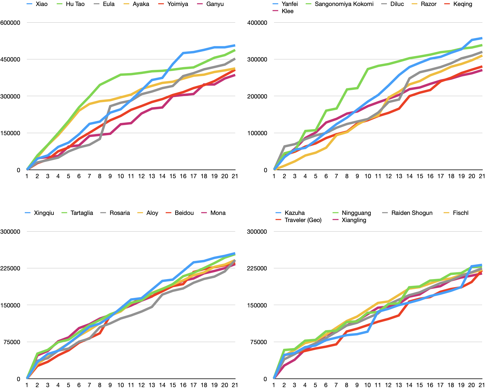

# Overview

The following image and table show the summary of 17914 combinations of characters, weapons and artifacts simulated using the program. The following table shows relative strength of the current characters at particular moment.

{{#include tables/character_rank.html}}
