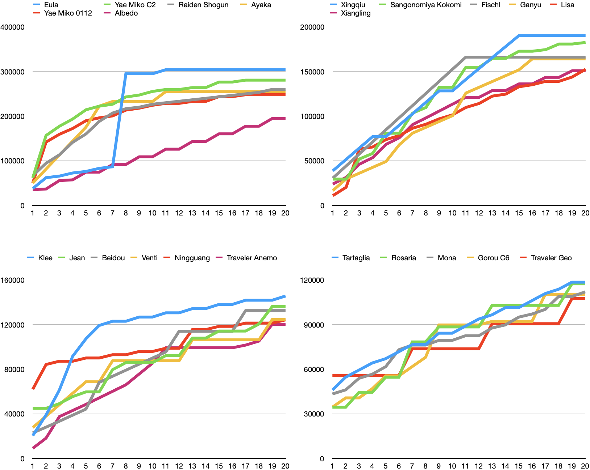

# Overview

The following image and table show the summary of 29041517 combinations of characters, weapons and artifacts simulated using the program. The following table shows relative strength of the current characters at particular moment.

There are 3 conditions to simulate characters in single member combat. In all the conditions, characters fight with a level 90 hilichurl, which does not drop any energy particles. The conditions include:

- Full energy: each character is given full energy at the beginning. The simulation lasts 20 seconds.
- 20 energies: each character is given 20 energies at the beginning. The simulation lasts 30 seconds.
- Off-field: The same as the full energy condition, but the enemy is immune to normal, charge and plunge attacks (it takes no damage from those attacks). The characters can still performs those actions. This means additional attacks of weapons (such as flute and skyward series) can deal damage.

For two member simulation, see each character page and navigate to the bottom of the page.

## Full energy

When full energy is given

{{#include tables/character_rank_full.html}}

## 20 energies

When 20 energies are given

{{#include tables/character_rank_e20.html}}

## Off-field

When the enemy is immune to normal, charge and plunge attacks (it takes no damage from those attacks). The characters can still performs those actions.

{{#include tables/character_rank_nonaca.html}}
