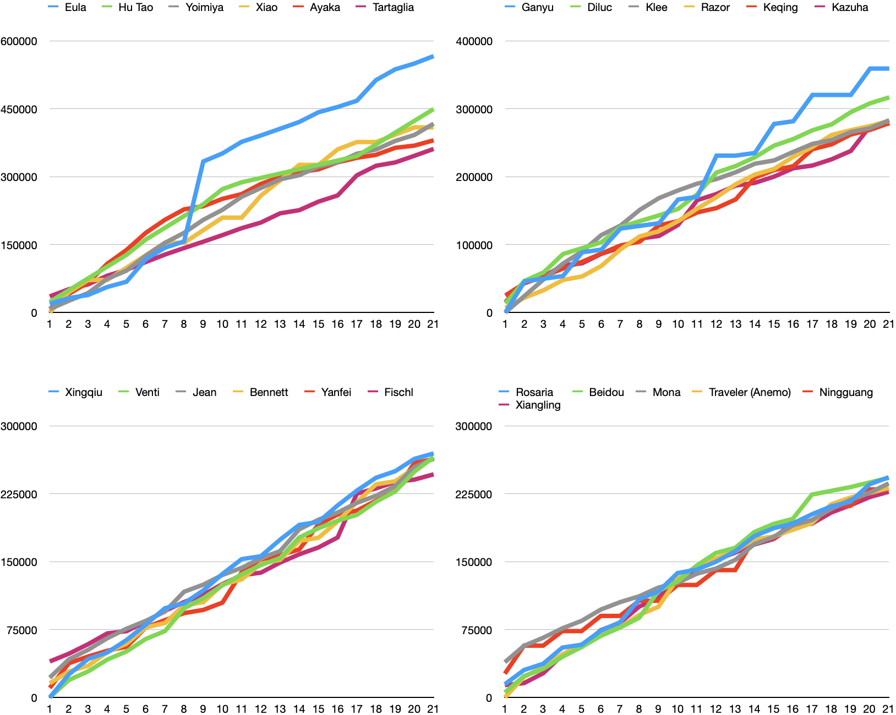

# Overview

The following image and table show the summary of 15208 combinations of characters, weapons and artifacts simulated using the program. Each row shows the best combination for each character and they are ranked by the total damage at 21 seconds.

{{#include tables/analyze.html}}
